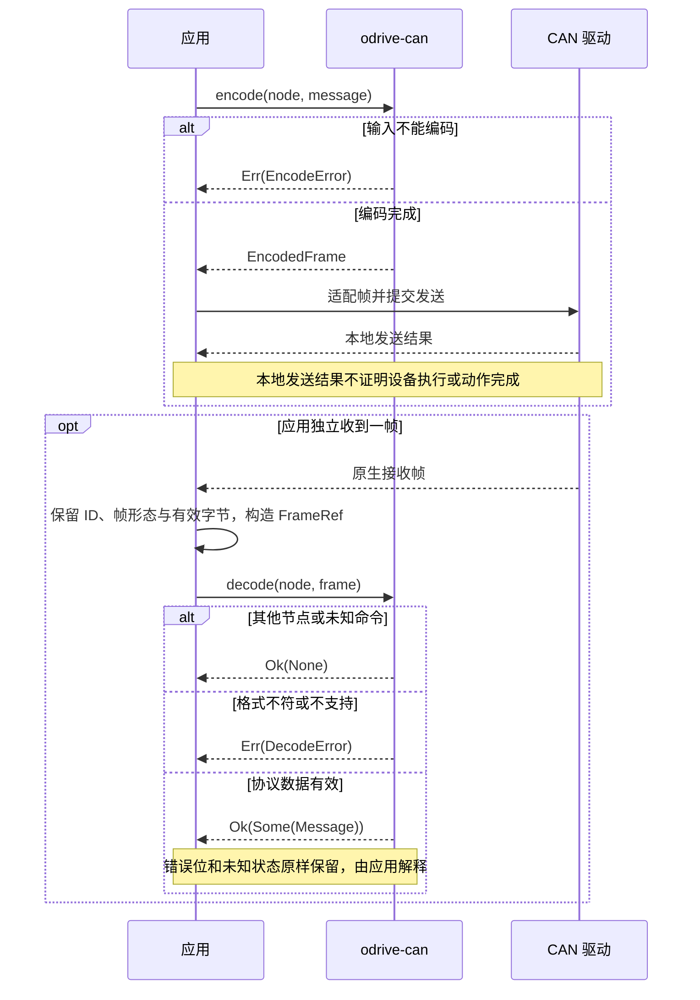

<!-- Copyright The odrive-can Contributors -->

# odrive-can

硬件无关的 ODrive CANSimple 编解码 Rust 库，首版固定支持官方 **fw-v0.5.1**。
单个 library crate，Rust 2024 Edition，`#![no_std]`，零依赖、无 `alloc`、无动态内存分配。

## 职责与范围

本库把显式协议值编码为标准 Classic CAN 帧，或从借用的帧视图解出消息。
完整覆盖 fw-v0.5.1 的 **23 个有效命令号**：14 个写命令、8 个 RTR 查询，以及 Heartbeat
和 8 类查询回复。包含轴状态、控制模式、位置／速度／转矩输入、限值与轨迹参数、
Anticogging、重启、清错和错误／编码器／电流／Sensorless／母线电压读取；
完整字段与长度见 [消息表](docs/protocol.md#完整消息表)。

`0x08 Set Axis Startup Config` 在官方版本中未实现，明确返回 `UnsupportedCommand`；
CANopen 保留项不属于本库支持的消息。扩展 ID 与 CAN FD 显式报错。不会根据长度猜测版本，
也不混入更新版的 Heartbeat、温度、电流或广播语义。

库不持有外设、不收发 CAN、不维护任务、队列、计时、重试或心跳新鲜度，也不执行
rpm／mm/s 换算、限幅、控制许可、停止或自动恢复。

**编码成功只表示协议转换完成。** 本地发送、设备是否执行、设备状态和运动结果须由
应用分别判断；Heartbeat 是状态数据，不是某条命令的 ACK。

## 快速使用

尚未发布到 crates.io。当前可直接以本地路径引用工作区成果：

```toml
[dependencies]
odrive-can = { path = "../odrive-can" }
```

下面只演示协议转换。节点、速度和转矩前馈都由调用方显式提供：

```rust
use odrive_can::{FrameId, FramePayload, FrameRef};
use odrive_can::fw_v0_5_1::{
    self as protocol, AxisState, Command, Message, NodeId, Query, Response,
};

fn main() -> Result<(), Box<dyn std::error::Error>> {
    let node = NodeId::new(1)?;
    let tx = protocol::encode(node, Message::Command(Command::SetInputVel {
        velocity: -2.5, // turn/s
        torque_ff: 0.25, // N·m
    }))?;
    assert_eq!(tx.id(), 0x02d);
    assert_eq!(tx.dlc(), 8);
    assert_eq!(tx.data(), &[0x00, 0x00, 0x20, 0xc0, 0x00, 0x00, 0x80, 0x3e]);

    let query = protocol::encode(node, Message::Request(Query::EncoderEstimates))?;
    assert!(query.is_remote());
    assert_eq!(query.dlc(), 8);
    assert!(query.data().is_empty()); // RTR 没有数据；DLC 表达请求长度

    // 独立给定的收到字节；未知错误位和高位非零状态都必须保留。
    let bytes = [0x01, 0x00, 0x00, 0x80, 0x08, 0x00, 0x01, 0x00];
    let rx = FrameRef {
        id: FrameId::Standard(0x021),
        payload: FramePayload::Data(&bytes),
    };
    assert_eq!(protocol::decode(node, rx)?, Some(Message::Response(
        Response::Heartbeat {
            axis_error: 0x8000_0001,
            axis_state: AxisState(0x0001_0008),
        }
    )));
    // 完整值并不等于 ClosedLoopControl (8)。
    assert_ne!(AxisState(0x0001_0008), AxisState(8));
    Ok(())
}
```

可运行的完整版本见 [`examples/encode_decode.rs`](examples/encode_decode.rs)：

```sh
cargo run --example encode_decode
```

更多接入方法见 [使用示例](examples/README.md)。

## 协议转换时序

下图描述应用与库的交接。发送和接收由应用调用驱动完成；图中不规定控制顺序、超时或重试。



## API、输入与输出

协议 API 位于 `odrive_can::fw_v0_5_1`：

| API／类型 | 作用 |
|---|---|
| `NodeId::new(u32)` | 验证 `0..=63`；越界报错，不通过掩码截断 |
| `Command` | Master 写命令；请求轴状态覆盖协议值，不限定 Idle／ClosedLoop |
| `Query` | Master RTR 读取命令 |
| `Response` | Axis 数据，包括设备错误、未知状态和原始浮点反馈 |
| `Message` | 区分命令、查询和回复的消息值 |
| `encode(node, message)` | 得到固定大小 `EncodedFrame`，通过 `id/data/dlc/is_remote` 交给应用 |
| `decode(node, FrameRef)` | 按显式节点过滤并解码；帧视图持有有效切片，零拷贝借用输入 |

标准 ID 为 `(node_id << 5) | command_id`；节点表示轴的 CAN 地址，而非轴索引。
端序全部为 little-endian，浮点为 IEEE 754 binary32。

- 速度单位 turn/s，转矩及转矩前馈单位 N·m，编码器位置单位 turn。
- `SetInputPos` 的 `velocity_ff: i16` 和 `torque_ff: i16` 直接表示协议整数，步长分别为
  `0.001 turn/s`、`0.001 N·m`；调用方决定舍入策略，库不执行浮点转整数或饱和。
- Sensorless 位置单位 **rad**，速度仍为 turn/s；轨迹加／减速度单位 turn/s²。
- 主机命令中的全部 `f32` 在编码时必须有限；正数、负数、零都可编码，不做物理范围限制。
- 解码完整保留 `u32` 状态、所有错误位，以及线上浮点（包括 NaN／无穷）。
  解码成功不等于传感器数据可用于控制。设备数据编码同样保留浮点位模式。

| 解码结果 | 意义 |
|---|---|
| `Ok(None)` | 其他标准节点或本版本未知／保留命令；不检查其载荷 |
| `Err(...)` | 非法标准 ID、不支持的扩展 ID，或相关消息长度／帧形态／字段格式错误 |
| `Ok(Some(message))` | 按此版本取得协议值；设备 error 非零也属于这里 |

相关的 CAN FD、非查询 RTR、数据长度错误都报错；扩展 ID 一律显式不支持。
对相关消息严格验证实际有效长度，不读取固定缓冲的补齐尾部。四字节字段的错误／Vbus
回复在该固件中**实际 DLC 为 8**，库按 8 字节处理。详细校验顺序与错误字段见 rustdoc。

**状态请求的固件限制：**文档定义 `u32`，本库完整编码 4 字节；官方回调却只读取低 16 位。
因此不能把高位非零的请求理解成设备必定保留或拒绝该值。已知值与未知值的线上表达由
`AxisState` 保留，具体状态是否受设备支持由应用判断。

## 官方来源与 MKS

官方 tag `fw-v0.5.1` 固定 revision 为
[`7831d795235e5ef8535e4b46621a0721b458ec8f`](https://github.com/odriverobotics/ODrive/tree/7831d795235e5ef8535e4b46621a0721b458ec8f)。
已实际交叉读取对应文档、CANSimple 实现、帧定义及字段单位，不用 latest 文档替代基线。

MKS ODrive Mini `0.5.1-20250326` 发布源码包（厂家仓库 revision
`e15782976ae93d42b1f0648ceec96503141a343b`）中的协议文档和 `can_simple.cpp` 与官方基线
逐字节相同。Heartbeat、Set Axis Requested State、Set Input Vel 的标准 Classic CAN
格式一致，同时保留上述低 16 位状态请求限制。

这是指定发布源码的兼容证据，未确认具体设备刷入的二进制，也未做实板验证。下载入口、
SHA-256、消息细节和参考项目差异见 [协议证据](docs/protocol.md)。

## 软件验证

最低 Rust 1.85（2024 Edition），CI 主检查使用 stable，另有 MSRV 库检查。没有 dependencies、
dev-dependencies、build-dependencies 或 feature 开关；库仅使用 `core`，主机 example／测试
可使用 `std`。本仓库不需要专用测试固件。

以下命令均在仓库目录执行：

```sh
cargo fmt --check
cargo test --all-targets
cargo test --doc
cargo run --example encode_decode
cargo clippy --all-targets -- -D warnings
RUSTDOCFLAGS="-D warnings" cargo doc --no-deps
cargo build --lib --target thumbv7em-none-eabihf
cargo build --lib --target thumbv6m-none-eabi
cargo tree --edges features
cargo metadata --format-version 1
cargo +1.85.0 check --lib
cargo package --locked
```

目标未安装时执行 `rustup target add thumbv7em-none-eabihf thumbv6m-none-eabi`。
本地未提交改动的打包检查可追加 `--allow-dirty`；CI 使用干净 checkout。
本地打包只检查包内容及重新构建，不上传。检查结果见 [验证记录](docs/validation.md)。

## License

[MIT](https://github.com/MRNIU/odrive-can/blob/main/LICENSE)，保留原版权 `Copyright (c) 2026 Niu Zhihong`。
