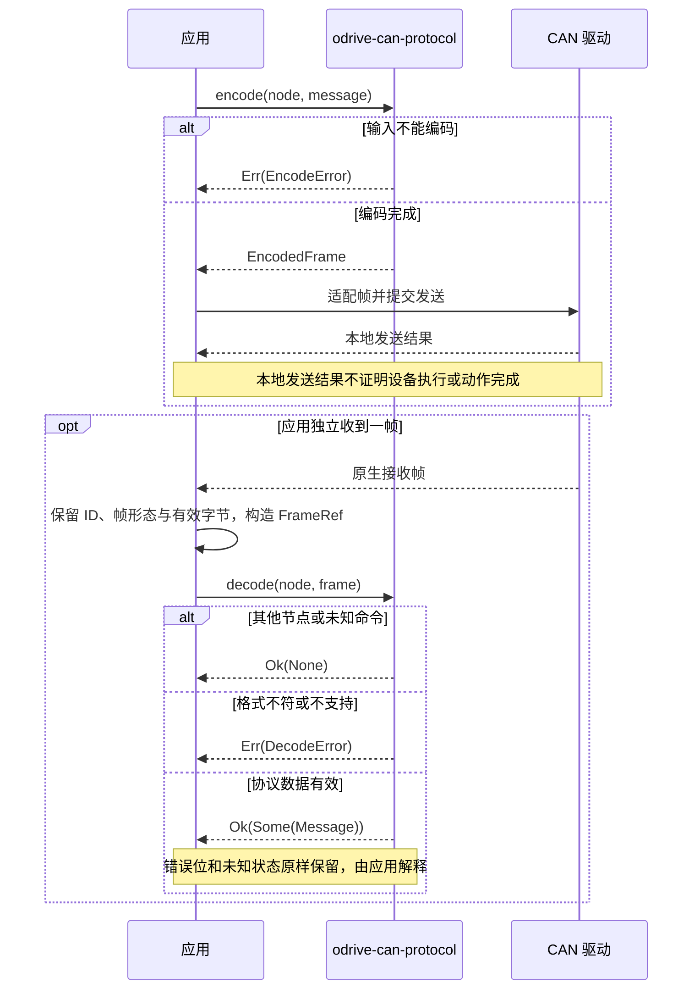

<!-- Copyright The odrive-can Contributors -->
<!-- 本文件介绍项目使用、协议支持、源码依据与贡献入口。 -->

# odrive-can-protocol

[](https://github.com/MRNIU/odrive-can/actions/workflows/ci.yml)
[](https://crates.io/crates/odrive-can-protocol)
[](https://docs.rs/odrive-can-protocol)
[](https://github.com/MRNIU/odrive-can/blob/main/LICENSE)
[](https://blog.rust-lang.org/2025/02/20/Rust-1.85.0/)

`odrive-can-protocol` 是硬件无关的 ODrive CANSimple 编解码库。它把显式协议值转换为 Classic CAN
帧，或从借用的帧视图还原协议值；不访问 CAN 外设，也不替应用决定时序或控制策略。

该 crate 使用 Rust 2024 Edition，`#![no_std]`、无 `alloc`、零依赖，最低支持 Rust 1.85。
它适合嵌入式固件、主机工具和已有 CAN 驱动之间的纯协议层。

## 安装

```toml
[dependencies]
odrive-can-protocol = "0.1"
```

也可以在同一工作区使用本地路径：

```toml
[dependencies]
odrive-can-protocol = { path = "../odrive-can" }
```

Rust 中的 crate 名为 `odrive_can_protocol`。完整 API 见 [rustdoc](https://docs.rs/odrive-can-protocol)。

## 快速开始

下面的例子只做协议转换：节点号、帧收发、命令是否被设备执行及后续状态判断均由应用负责。

```rust
use odrive_can_protocol::fw_v0_5_1::{
    self as protocol, AxisState, Command, Message, NodeId, Query, Response,
};
use odrive_can_protocol::{FrameId, FramePayload, FrameRef};

fn main() -> Result<(), Box<dyn std::error::Error>> {
    let node = NodeId::new(1)?;
    let tx = protocol::encode(
        node,
        Message::Command(Command::SetInputVel {
            velocity: -2.5, // turn/s
            torque_ff: 0.25, // N·m
        }),
    )?;
    assert_eq!(tx.id(), 0x02d);
    assert_eq!(tx.data(), &[0x00, 0x00, 0x20, 0xc0, 0x00, 0x00, 0x80, 0x3e]);

    let query = protocol::encode(node, Message::Request(Query::EncoderEstimates))?;
    assert!(query.is_remote());
    assert_eq!(query.dlc(), 8);
    assert!(query.data().is_empty()); // RTR 无数据；DLC 表示请求长度

    let bytes = [0x01, 0x00, 0x00, 0x80, 0x08, 0x00, 0x01, 0x00];
    let rx = FrameRef {
        id: FrameId::Standard(0x021),
        payload: FramePayload::Data(&bytes),
    };
    assert_eq!(
        protocol::decode(node, rx)?,
        Some(Message::Response(Response::Heartbeat {
            axis_error: 0x8000_0001,
            axis_state: AxisState(0x0001_0008),
        }))
    );
    Ok(())
}
```

仓库中可直接运行相同语义的示例：

```sh
cargo run --example encode_decode
```

更多驱动适配方式见 [examples](https://github.com/MRNIU/odrive-can/tree/main/examples)。

## 协议 API 与边界

当前实现位于 `odrive_can_protocol::fw_v0_5_1`，并在 crate 根重导出主要类型和 `encode`／`decode`。

| API／类型 | 语义 |
|---|---|
| `NodeId::new(u32)` | 验证节点号为 `0..=63`，越界报错，不通过掩码截断。节点是 CAN 地址，不是轴索引。 |
| `Command` | 主机写命令。状态、模式和范围是否被设备接受由应用与设备共同决定。 |
| `Query` | 主机以 RTR 发出的读取请求。 |
| `Response` | 轴的 Heartbeat 或读取回复；错误位、未知状态和原始浮点反馈均是有效协议数据。 |
| `encode(node, message)` | 返回 `Result<EncodedFrame, EncodeError>`；成功只说明已完成协议编码。 |
| `decode(node, frame)` | 返回 `Result<Option<Message>, DecodeError>`；不会收发帧或把消息和一次动作关联。 |

`decode` 的三种结果：

| 结果 | 含义 |
|---|---|
| `Ok(Some(message))` | 此节点的一条已知协议消息。非零设备错误仍在此分支，必须由应用处理。 |
| `Ok(None)` | 其他节点，或当前基线未知／保留命令；不会读取其载荷来猜测版本。 |
| `Err(...)` | 不支持的帧或无法满足此消息的格式合同，例如扩展 ID、CAN FD、帧形态或长度错误。 |

标准 11-bit ID 为 `(node_id << 5) | command_id`。多字节字段均为 little-endian，`f32`
为 IEEE 754 binary32。编码主机命令拒绝 NaN 和无穷；解码保留线上浮点位模式（包括非有限值）、
完整 `u32` 轴状态及未知错误位。库不做单位换算、范围限幅、许可、停止、重试、心跳新鲜度或恢复。

查询编码为 DLC 8 且没有数据的 RTR 帧；解码接受 DLC `0..=8` 的 RTR，因为该固件只检查
RTR 形态。已知数据帧严格按表中实际长度校验。Heartbeat 不是某个写命令的 ACK，发送成功也
不能证明设备执行或动作完成。

## 协议转换时序



## 版本支持

本库面向 ODrive CANSimple，按固件版本组织协议 API，后续将逐步增加其他版本支持。

| 协议版本 | 模块 | 支持状态 |
|---|---|---|
| ODrive `fw-v0.5.1` | `fw_v0_5_1` | 已实现并核验全部有效消息，支持标准 Classic CAN |
| 其他固件版本 | — | 尚未实现，欢迎按贡献指南补充支持 |

这个基线完整实现 23 个有效命令号：14 个主机写命令、8 个 RTR 查询、Heartbeat 和 8 种
查询回复。全部字段使用 little-endian；所有轴数据回复的实际 DLC 均为 8，即便其中只有
前 4 字节有定义字段。新增版本必须先以其固定源码 revision 核对命令、方向、字段、单位和
实际帧长度，再提供明确的版本 API 与独立测试；不得依据帧长度、USB 版本字符串或未知字段
自动切换版本。

当前基线只支持标准 Classic CAN：扩展 ID 与 CAN FD 显式报错。节点 63 是普通地址，不带
后来版本可能具有的广播／发现语义。

### `fw_v0_5_1` 完整消息表

`M` 表示主机，`A` 表示轴。字段从 byte 0 依次排列；长度是数据帧的实际长度，查询方向为
`M RTR → A data`。

| ID | 消息 | 方向 | 字段／单位 | 长度 |
|---|---|---|---|---:|
| `0x01` | Heartbeat | A data | axis error `u32`；axis state `u32` | 8 |
| `0x02` | Estop | M data | 无 | 0 |
| `0x03` | Get Motor Error | RTR → A | error `u32`；尾部 4 字节 | 8 |
| `0x04` | Get Encoder Error | RTR → A | error `u32`；尾部 4 字节 | 8 |
| `0x05` | Get Sensorless Error | RTR → A | error `u32`；尾部 4 字节 | 8 |
| `0x06` | Set Axis Node ID | M data | 新 node id `u32` | 4 |
| `0x07` | Set Axis Requested State | M data | requested state `u32` | 4 |
| `0x09` | Get Encoder Estimates | RTR → A | position `f32` turn；velocity `f32` turn/s | 8 |
| `0x0A` | Get Encoder Count | RTR → A | shadow count `i32`；count in CPR `i32` | 8 |
| `0x0B` | Set Controller Modes | M data | control mode `i32`；input mode `i32` | 8 |
| `0x0C` | Set Input Pos | M data | position `f32` turn；velocity FF `i16 × 0.001` turn/s；torque FF `i16 × 0.001` N·m | 8 |
| `0x0D` | Set Input Vel | M data | velocity `f32` turn/s；torque FF `f32` N·m | 8 |
| `0x0E` | Set Input Torque | M data | torque `f32` N·m | 4 |
| `0x0F` | Set Velocity Limit | M data | velocity limit `f32` turn/s | 4 |
| `0x10` | Start Anticogging | M data | 无 | 0 |
| `0x11` | Set Traj Vel Limit | M data | velocity limit `f32` turn/s | 4 |
| `0x12` | Set Traj Accel Limits | M data | acceleration `f32`；deceleration `f32`，均 turn/s² | 8 |
| `0x13` | Set Traj Inertia | M data | inertia `f32`；原始 controller 参数 | 4 |
| `0x14` | Get IQ | RTR → A | Iq setpoint `f32` A；Iq measured `f32` A | 8 |
| `0x15` | Get Sensorless Estimates | RTR → A | PLL position `f32` rad；velocity `f32` turn/s | 8 |
| `0x16` | Reboot ODrive | M data | 无 | 0 |
| `0x17` | Get Vbus Voltage | RTR → A | voltage `f32` V；尾部 4 字节 | 8 |
| `0x18` | Clear Errors | M data | 无 | 0 |

`0x08 Set Axis Startup Config` 在该固件中未实现，对当前节点返回
`DecodeError::UnsupportedCommand`；`0x00`、文档中的 `0x700` 与 `0x19..=0x1f` 没有该基线
的 CANSimple 消息语义。CANopen `0x700` 不是 5-bit command，不能与节点号合成。标准 ID
`0x700` 会按 node 56／command 0 处理，并不是一个可整体屏蔽的地址段。

### 基线证据与实现差异

官方 `fw-v0.5.1` tag 固定为 revision
[`7831d795235e5ef8535e4b46621a0721b458ec8f`](https://github.com/odriverobotics/ODrive/tree/7831d795235e5ef8535e4b46621a0721b458ec8f)。
核对了该 revision 的[协议文档](https://github.com/odriverobotics/ODrive/blob/7831d795235e5ef8535e4b46621a0721b458ec8f/docs/can-protocol.md)、[CANSimple 实现](https://github.com/odriverobotics/ODrive/blob/7831d795235e5ef8535e4b46621a0721b458ec8f/Firmware/communication/can_simple.cpp)、[命令枚举](https://github.com/odriverobotics/ODrive/blob/7831d795235e5ef8535e4b46621a0721b458ec8f/Firmware/communication/can_simple.hpp)、[帧字段辅助代码](https://github.com/odriverobotics/ODrive/blob/7831d795235e5ef8535e4b46621a0721b458ec8f/Firmware/communication/can_helpers.hpp)、[Classic CAN 收发实现](https://github.com/odriverobotics/ODrive/blob/7831d795235e5ef8535e4b46621a0721b458ec8f/Firmware/communication/interface_can.cpp)
和 [Sensorless 单位定义](https://github.com/odriverobotics/ODrive/blob/7831d795235e5ef8535e4b46621a0721b458ec8f/Firmware/MotorControl/sensorless_estimator.hpp)。

| 证据发现 | 本库合同 |
|---|---|
| Heartbeat 是两个完整 `u32`。 | 保留完整状态和所有未知 error bits；只有精确值才可与已知状态常量比较。 |
| 文档定义的状态请求字段是 `u32`，回调实际只读低 16 bit。 | 编码完整 4 字节，但高位非零的值不表示设备会按完整 `u32` 执行。 |
| 三种错误回复和 Vbus 回复都实际发送 DLC 8。 | 后 4 字节由编码回复清零，解码忽略其值但要求实际 DLC 8。 |
| 固件对某些接收帧的长度或 RTR 很宽松。 | 本库按表严格检查 0／4／8 字节及帧形态；这不是对设备拒绝行为的声明。 |
| 部分 Get 行的文档方向不精确，Get Vbus 也缺查询星号。 | 以源码为准：由主机 RTR 发起，轴以数据帧回复。 |
| Sensorless 发送的是 `pll_pos_`。 | Sensorless 位置为 rad，不沿用 Encoder Estimates 的 turn。 |

<details>
<summary>MKS ODrive Mini 的发布源码交叉核对</summary>

核对的发布包为
[ODriveMINI-fw-v0.5.1-20250326](https://github.com/makerbase-motor/MKS-ODrive/blob/e15782976ae93d42b1f0648ceec96503141a343b/Firmware/MKS%20ODrive%20MINI/ODriveMINI-fw-v0.5.1-20250326.rar)，
厂家仓库 revision 为 `e15782976ae93d42b1f0648ceec96503141a343b`，RAR SHA-256 为
`a8cbc2af68deccdadad150e20d8337cc7a1ae430f8ccb441625315e2f04d2430`。解压后下列文件与
上述官方 revision 的同路径文件逐字节一致：

| 文件 | SHA-256 |
|---|---|
| `docs/can-protocol.md` | `1d6dcd3798df071313a667bd2a076949d73fe40cb2c18c0f7644faaf6b658fb5` |
| `Firmware/communication/can_simple.cpp` | `b2d0a8f78605fe3bc0e411bd3649bbf562d0db4eec39fd1dccc98998436741bd` |
| `Firmware/communication/can_helpers.hpp` | `b171f27d478493a6ea714a20cd86bd8d625312f886f5a0f671044c4e38169c4b` |

这只证明该发布源码包与基线的协议文件一致，不确认任何具体设备刷入的二进制，也不构成
实板、总线或运动验证。它不能推及其他 MKS 版本、厂商修改版或未来版本。
</details>

只读参考项目
[`raoz/odrive-messages` at `37990cb157f667cdd0ddb441f907066e4126fbef`](https://github.com/raoz/odrive-messages/tree/37990cb157f667cdd0ddb441f907066e4126fbef)
属于更新协议：其中 `0x00` 是 GetVersion，`0x03` 是复合错误，`0x04/0x05` 是 SDO，`0x15`
是温度，`0x17` 含母线电流，Heartbeat 布局也不同。因此仅借鉴纯协议层职责分离，不采用其
wire 格式或代码。

## 开发与贡献

提交前可运行：

```sh
cargo fmt --check
cargo test --all-targets
cargo test --doc
cargo clippy --all-targets -- -D warnings
RUSTDOCFLAGS="-D warnings" cargo doc --no-deps
cargo +1.85.0 check --lib
```

贡献流程、协议变更要求和验证范围见 [CONTRIBUTING.md](https://github.com/MRNIU/odrive-can/blob/main/CONTRIBUTING.md)。协议变更必须以
固定版本源码核对，并同步更新本 README 的版本支持和证据说明。

## License

本项目采用 [MIT License](https://github.com/MRNIU/odrive-can/blob/main/LICENSE)，保留原版权信息。
